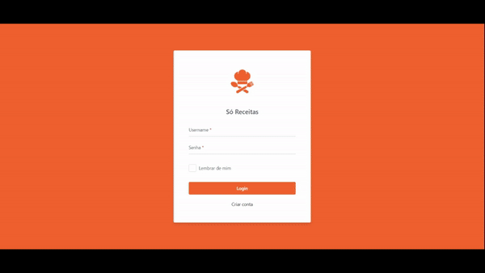

Aplicação Outsystems simples de um site de receitas. 
 
 

### 💻 Objetivo
O objetivo do projeto é que o usuário possa acessar receitas já adicionadas por outras pessoas e criar/editar suas próprias receitas.

### 🔗 Link do site
https://personal-hytif762.outsystemscloud.com/SoReceitasWebSite/
 

    

